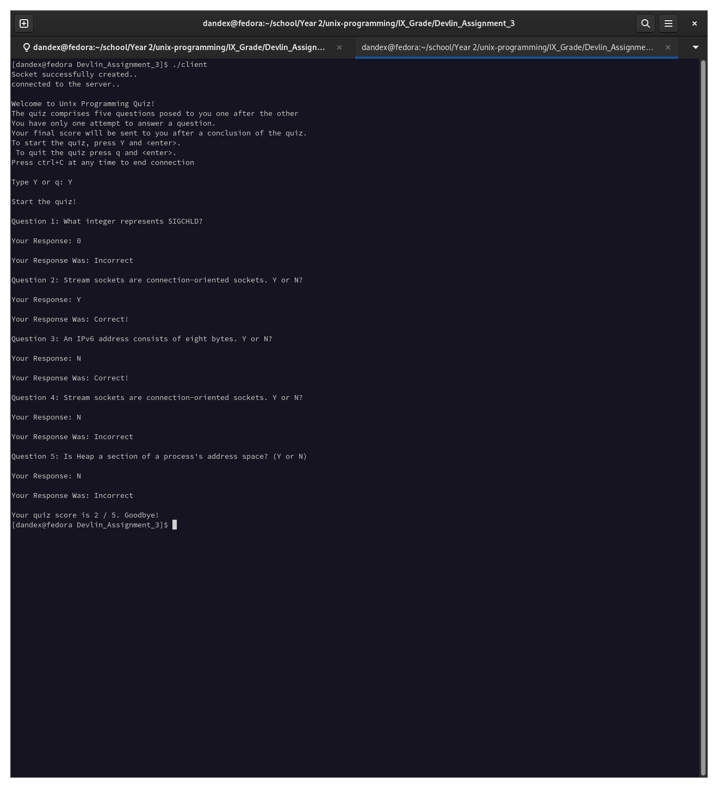

# TCP Client-Server Quiz Application

<h2>Summary</h2>
A TCP socket Client and Server quiz application written in C. The server establishes connection with the client, asks client if they wish to start quiz or quit, then randomly selects 5 questions and allows client to answer. At the end, quiz total of correct answers is displayed. 
<h2>Screenshot</h2>

<h2>Guide</h2>
  <ol>
    <li>Download server.c, client.c, and QuizDB.h</li>
    <li>gcc -o server server.c</li>
    <li>gcc -o client client.c</li>
    <li>In one terminal window, ./server</li>
    <li>In a different terminal window, ./client</li>
  <ol>
